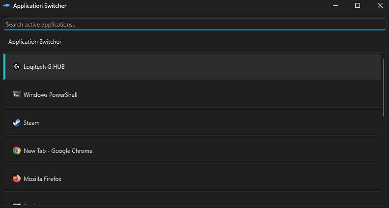

# Application Switcher




## Overview
- This is a python recreation of the windows tool "Window Walker" shipped in the windows powertoys package. 
- The tool opens a gui showing active applications
- You are able to filter by typing with the gui window open and can navigate the list of applications using up/down arrows or mouse movement
- Pressing enter or double clicking will open the selected application window. 

## Features

- Real-time listing of active windows
- Keyboard navigation (Up/Down, Enter)
- Mouse navigation + double-click activation
- Focus-safe window activation
- Minimal, fast PySide6 GUI

## Requirements

- Windows 10/11
- Python 3.11+

## Installation

Clone the repository:

```
git clone https://github.com/NightCodeOfficial/Application-Switcher.git
cd Application-Switcher
```

Create virtual environment (choose one):

**Command Prompt:**
```
python -m venv venv
venv\Scripts\activate
```

**PowerShell:**
```
python -m venv venv
.\venv\Scripts\Activate.ps1
```

Install dependencies:
```
pip install -r requirements.txt
```

## Usage

Run the application:
```
python main.py
```

## Controls

- Up / Down: move selection
- Enter: activate selected window
- Esc: close switcher
- Double click: activate selected window

## TODO

### Core Behavior
- [ ] Add ability to close selected application
- [ ] Filter out system applications and only display useful apps

### Refresh System
- [ ] Implement periodic window list refresh
- [ ] Make refresh non-blocking (threaded or timer-based)
- [ ] Prevent selection reset during refresh

### Global Activation
- [ ] Add global key combo listener
- [ ] Ensure single instance
- [ ] Bring existing switcher window to foreground when combo is pressed